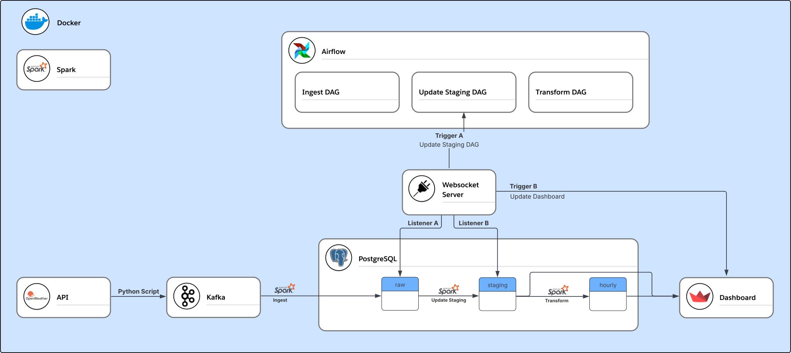
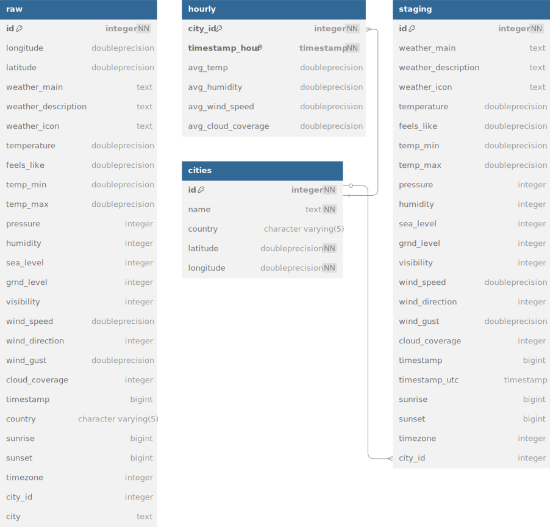

# 🌤 Real-Time Weather Data Pipeline
Just want to get started?  👉 [How to Run ](#-how-to-run)
## 📌 Project Overview

This project is a **real-time weather data pipeline** that ingests, processes, stores, and visualises weather data on a dashboard in a **fully containerised environment** using **Kafka, Spark, PostgreSQL, Airflow, and Streamlit**.


## 🔹 Architecture Overview

### 📡 Data Ingestion (Kafka Producer)

- A Kafka producer fetches **real-time weather data** from an external API (prod) or a synthetic generator (dev).
- The producer sends this data to a Kafka topic (**weather-data-topic**).
- Data is structured in **JSON format**, containing:
  - **Temperature, humidity, wind speed, cloud cover, pressure, visibility**, etc.

### 🚀 Stream Processing (Spark Streaming)

- **PySpark Structured Streaming** reads data from Kafka (**weather-data-topic**).
- The data undergoes **flattening, transformation, and validation**.
- Filtered and transformed records are stored in **PostgreSQL**.

### 🗄️ Data Storage (PostgreSQL)

The processed data is stored in the following tables:

- **raw**: Stores raw ingested data from Kafka. Often contains duplicate records.
- **staging**: Stores deduplicated and clean data for dashboard and aggregations.
- **cities**: Stores static city information instead of duplicating it for each record.
- **hourly**: Stores transformed and aggregated data for visualisation.

### 📊 Real-Time Dashboard (Streamlit)

- A **Streamlit dashboard** reads from PostgreSQL and visualises:
  - **Current Weather Metrics** (Temperature, Humidity, Wind Speed, etc.).
  - **Aggregate data over the last 24 hours**
  - **Weather Map Integration** using **Folium**.
  - **Real-time updates** using **WebSockets**.

### 📢 Event-Driven Updates (WebSocket & Airflow)

- **WebSocket Server** notifies the dashboard **whenever new staging data is available**.
- **Automated DAG triggers** by Websocket Server upon notification of new raw data to deduplicate 
- **Airflow DAGs** automate **data extraction, transformation, and loading (ETL)** processes.
- Spark nodes **execute processing** rather than Airflow handling transformations.

## 🛠️ Architectural Overview  

- All components are **containerised** and dependencies accounted for in **Docker Compose**

| 📌 **Component**       | 🚀 **Technology Used**                              |
|------------------------|-----------------------------------------------------|
| **Data Ingestion**     | **Kafka Producer** (API / Synthetic)  |
| **Processing & Transformation**  | **PySpark Structured Streaming**  |
| **Database**          | **PostgreSQL**  |
| **Orchestration**     | **Apache Airflow**  |
| **Visualisation**     | **Streamlit (Web Dashboard)**  |
| **Messaging**         | **WebSockets**  |
| **Containerisation**  | **Docker & Docker Compose**  |

<details open>
  <summary>🌐 Architectural Overview Diagram</summary>
  
  
</details>

<details>
  <summary>📊 Entity Relationship Diagram (ERD)</summary>
  
  
</details>

<details>
  <summary>🔄 Data Lineage Diagram</summary>

  
</details>


## 📜 How to Run

1️⃣ Clone the repository:

```sh
git clone https://github.com/chardrew/weather-dashboard.git
cd weather-dashboard
```
2️⃣ Get your free API key:
- Sign up to [OpenWeather](https://home.openweathermap.org/users/sign_up)
- Navigate to API Keys and generate an API key

3️⃣ Create a `.env` file and set up environment variables:

```sh
cp ./.env.example .env
rm ./.env.example
```
- Open ```.env``` and enter your desired database password and your API key
```sh
# Weather Postgres Database
DATABASE_PASSWORD='<YOUR_DB_PASSWORD_HERE>'               # your password
...
# OpenWeather API
API_URL='http://api.openweathermap.org/data/2.5/weather'  # leave as is
API_KEY='<YOUR_API_KEY_HERE>'                             # your API key
```

4️⃣ Save and start the entire stack using Docker Compose:

Use ```--profile dev``` to use the weather data simulator or ```--profile prod``` to hit the real OpenWeather API 
```sh
docker-compose --profile prod up -d
```

5️⃣ Trigger the Ingestion DAG and unpause other DAGs (only very first trigger must be manual)

- In the **Airflow UI** → [http://localhost:8080](http://localhost:8080) (**username:** airflow / **password:** airflow)
  - Ensure you trigger AND unpause all 3 DAGs
- OR through the command line: 
```
docker exec -it airflow-webserver bash -c 'for d in WeatherIngest WeatherStagingUpdate WeatherTransform; do airflow dags unpause $d; done; airflow dags trigger WeatherIngest'

```

6️⃣ Access the dashboard:
- **Streamlit Dashboard** → [http://localhost:8501](http://localhost:8501)

7️ To stop 🛑

Use the same profile used to start, i.e. ```--profile dev``` if in development mode or ```--profile prod```if using the real OpenWeather API .
```sh
docker-compose --profile prod down
```

## 🚀 Future Enhancements

### 🎨 UI/UX Improvements
-  **Enhanced Weather Visualizations** (e.g., wind speed radar, precipitation heatmaps).
- **WebSocket Connection Status Indicator** to show real-time data updates.
- **Mobile-Friendly Dashboard** with a responsive Streamlit UI.

### 🛠 Performance & Scalability
- **Deploy on Kubernetes** for better **scalability** and **fault tolerance**.
- **Index Key Columns in PostgreSQL** to enhance query performance.
- **Use a Schema Registry** to standardise and enforce schemas more strictly.


### 🔍 Reliability & Monitoring
- **Health Checks for All Services** (Spark, Airflow, WebSocket Server).
- **Centralized Logging with ELK Stack** (Elasticsearch, Logstash, Kibana) for better debugging and analytics.

### 📊 Data & Intelligence
- **Multi-Location Weather Support** (Currently only one).
- **Integrating Predictive Analytics** (ML models for weather forecasting).


## 🌍 **Enjoy your Real-Time Weather Dashboard!**

